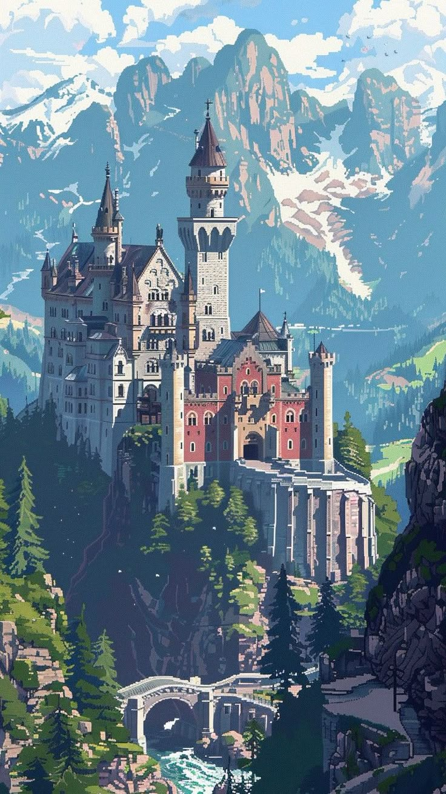
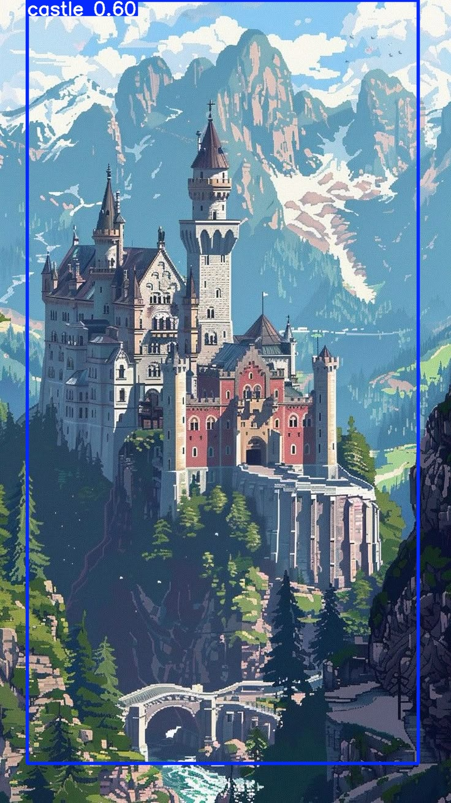
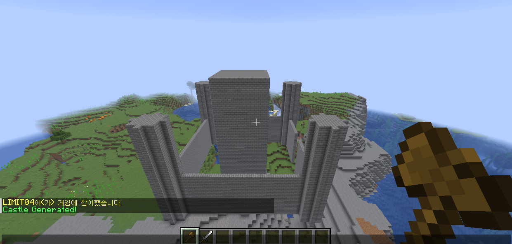
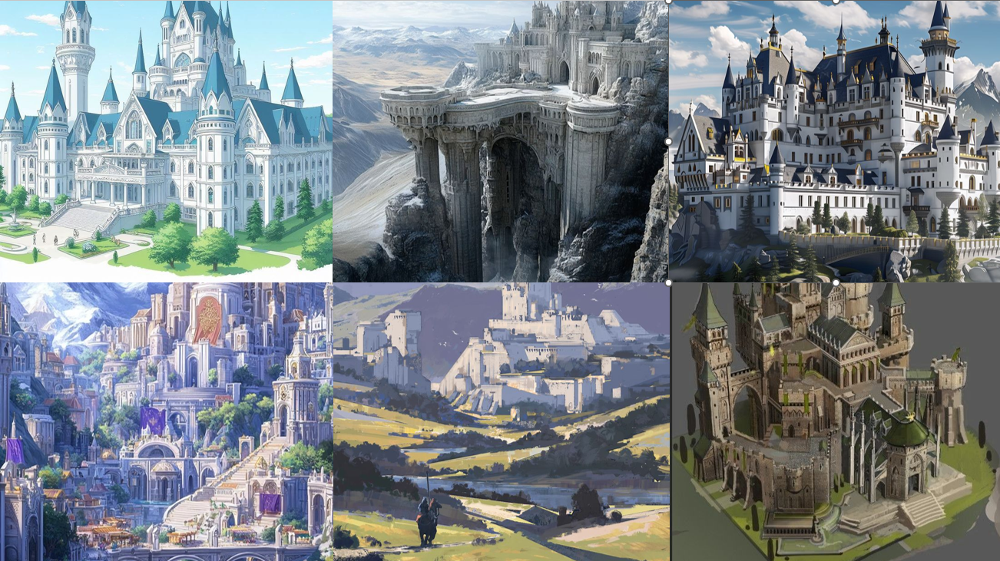
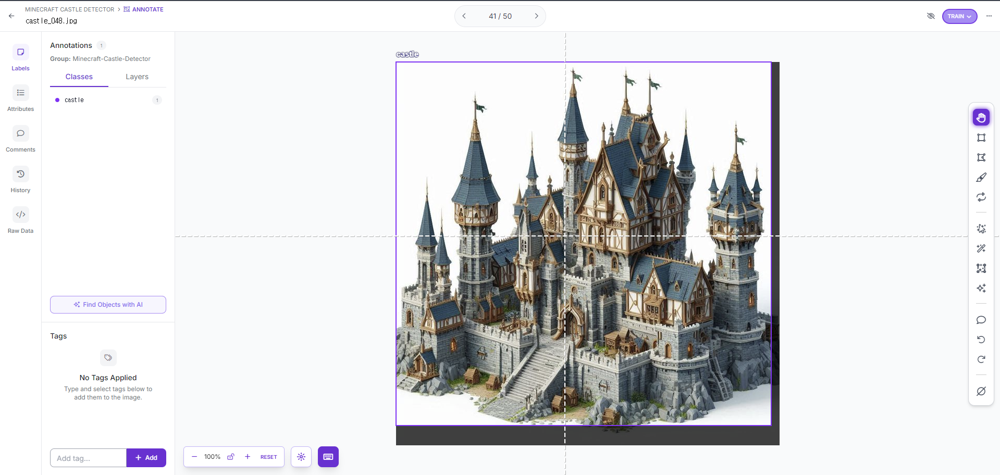
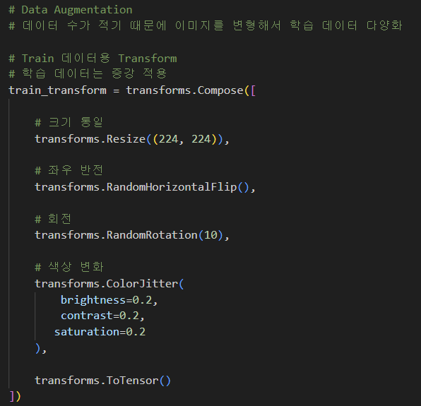

# Minecraft Structure Generator

## 프로젝트 소개

컴퓨터 비전 기술을 활용하여 판타지 건축물 이미지를 분석하고, 이를 기반으로 마인크래프트 구조물을 자동 생성하는 프로젝트입니다.

입력 이미지에서 성(Castle)을 인식한 뒤, 객체 탐지 및 특징 추출 과정을 거쳐 구조물 설계도(Blueprint)를 생성하고, 최종적으로 마인크래프트에서 실제 구조물을 생성합니다.

---

## 프로젝트 목표

기존의 이미지 분류 또는 객체 탐지 프로젝트는 객체를 인식하는 단계에서 끝나는 경우가 많습니다.

본 프로젝트는 단순히 성을 인식하는 것에서 끝나지 않고,

* 이미지 분석
* 객체 탐지
* 구조 정보 생성
* 마인크래프트 구조물 생성

까지의 전체 파이프라인을 구현하는 것을 목표로 하였습니다.

본 프로젝트는 공개 데이터셋을 단순 활용하는 것이 아니라, 데이터 수집, 데이터 정제, 라벨링, 모델 학습, 구조 생성, Minecraft 연동까지 전 과정을 직접 구현한 End-to-End 프로젝트입니다.

단순한 객체 탐지(Object Detection)에 그치지 않고, 탐지 결과를 실제 게임 콘텐츠 생성으로 연결하는 것을 목표로 하였습니다.

---

## 시스템 구조

```text
Fantasy Castle Image
        ↓
CNN Classification
        ↓
YOLO Detection
        ↓
Bounding Box Extraction
        ↓
Blueprint Generation
        ↓
Layout Generation
        ↓
Minecraft Block Data
        ↓
JSON Export
        ↓
PaperMC Plugin
        ↓
Minecraft Structure
```

---

# 실행 결과

## 1. 입력 이미지



성 이미지를 입력으로 사용합니다.

---

## 2. YOLO 객체 탐지



YOLOv8을 이용하여 성(Castle)의 위치를 탐지합니다.

---

## 3. Blueprint 생성

탐지된 Bounding Box의 너비 및 높이 비율을 이용하여 구조물의 크기와 주요 파라미터를 생성합니다.

참조 파일:

```text
src/ai/predict_yolo.py
src/generation/blueprint_from_yolo.py
```

예시:

```python
{
    "type": "castle",
    "size": "large",
    "tower_count": 4,
    "tower_height": 27,
    "wall_height": 13,
    "keep_size": 14,
    "keep_height": 33
}
```

---

## 4. Layout 생성

Blueprint를 기반으로 성의 주요 구성 요소의 상대 좌표를 생성합니다.

참조 파일:

```text
src/generation/layout_generator.py
```

생성 요소:

* Tower
* Keep
* Gate
* Wall

---

## 5. Minecraft 구조물 생성



생성된 Layout 정보는 11,355개의 블록 데이터로 변환되며 JSON 파일로 저장됩니다.

PaperMC 플러그인은 해당 JSON 파일을 읽어 실제 마인크래프트 월드에 구조물을 생성합니다.

참조 파일:

```text
src/structures/castle_generator.py
StructurePlugin/src/main/java/com/aporia/commands/GenerateCastleCommand.java
```

### 생성 결과

* Total Blocks: 11,355
* Structure Type: Castle
* Generation Method: Procedural Generation

---

# 데이터셋 구축 과정

본 프로젝트에서는 프로젝트 목표에 적합한 공개 데이터셋이 존재하지 않았기 때문에 데이터셋을 직접 구축하였습니다.

## 데이터 수집

프로젝트 목적에 적합한 공개 데이터셋이 존재하지 않았기 때문에 판타지 성(Fantasy Castle) 이미지를 직접 수집하여 데이터셋을 구축하였습니다.

이미지는 Pinterest에서 다양한 판타지 성 컨셉 아트 및 일러스트를 수집하였으며, 다음과 같은 다양성을 확보하고자 하였습니다.

* 다양한 건축 양식
* 다양한 시점(Viewpoint)
* 다양한 배경 환경
* 다양한 성 규모

### dataset sample


이를 통해 특정 스타일에 과적합되지 않는 모델을 구축하고자 하였습니다.

---

## 데이터 정제

수집된 이미지 중 다음과 같은 데이터를 제거하였습니다.

* 중복 이미지
* 해상도가 지나치게 낮은 이미지
* 성이 명확하게 보이지 않는 이미지

정제 과정을 통해 학습 데이터의 품질을 향상시켰습니다.

---

## YOLO 데이터셋 구축

YOLO 객체 탐지를 위해 모든 이미지에 대해 직접 Bounding Box 라벨링을 수행하였습니다.

### 클래스

* Castle

### 라벨링 방식

* Manual Bounding Box Annotation
* Roboflow 활용

### 라벨링
| label |
|------------|
|  |

### 최종 데이터 수

* 87 Images
* 1 Class (Castle)

모든 Bounding Box는 직접 생성하였으며, 성의 위치와 크기를 학습할 수 있도록 구성하였습니다.

---

## 데이터 증강(Data Augmentation)

수집 가능한 판타지 성 이미지 수가 제한적이었기 때문에 모델의 일반화 성능을 향상시키기 위해 데이터 증강(Data Augmentation)을 적용하였습니다.

적용한 증강 기법은 다음과 같습니다.

- Horizontal Flip (좌우 반전)
- Random Rotation (±10° 회전)
- Brightness Adjustment
- Contrast Adjustment
- Saturation Adjustment



이를 통해 제한된 데이터 환경에서도 다양한 형태의 성 이미지를 학습할 수 있도록 하였습니다.

### 활용 목적

* 과적합 방지
* 다양한 성 형태 학습
* 새로운 환경에 대한 일반화 성능 향상

이를 통해 제한된 데이터 환경에서도 안정적인 객체 탐지가 가능하도록 하였습니다.

---

# 사용 기술

## Computer Vision

* Python
* OpenCV
* PyTorch
* YOLOv8 (Ultralytics)

## Structure Generation

* Procedural Generation
* Blueprint Generator
* Layout Generator

## Minecraft

* Java
* PaperMC
* Maven
* Gson

---

# 데이터셋

## 클래스

* Castle

## 데이터 수

* Total Images: 87

## 데이터 분할

* Train: 70%
* Validation: 20%
* Test: 10%

---

# 프로젝트 성과

* 판타지 성 이미지 데이터셋 직접 구축
* YOLO 학습용 Bounding Box 직접 라벨링
* YOLOv8 기반 Castle Detection 모델 학습
* Bounding Box 기반 구조 파라미터 추출
* 이미지 기반 Blueprint 자동 생성
* Procedural Structure Generation 구현
* 11,355개 블록 규모의 Minecraft 구조물 생성
* JSON 기반 Minecraft Structure Export
* Python ↔ Java 연동 파이프라인 구축
* PaperMC Plugin 연동
* Image → Minecraft 자동 생성 파이프라인 구축

---

## 전체 파이프라인 결과

| Input Image | YOLO Detection | Minecraft Result |
|------------|---------------|------------------|
|  |  |  |

---

# Future Work

## Computer Vision

* Tower Detection
* Gate Detection
* Wall Detection
* Multi-Class Detection

## Structure Generation

* Village Generation
* Dungeon Generation
* Building Style Diversification

## Minecraft

* Real-Time World Generation
* Automatic Structure Placement
* AI-Based Structure Expansion

---

# 프로젝트 결과

본 프로젝트는 컴퓨터 비전 기술을 활용하여 판타지 이미지를 분석하고, 이를 실제 마인크래프트 구조물로 변환하는 전체 파이프라인을 구현하였습니다.

단순한 객체 탐지에 그치지 않고, 탐지 결과를 게임 내 구조물 생성으로 연결함으로써 Computer Vision과 Procedural Generation의 응용 가능성을 확인할 수 있었습니다.
